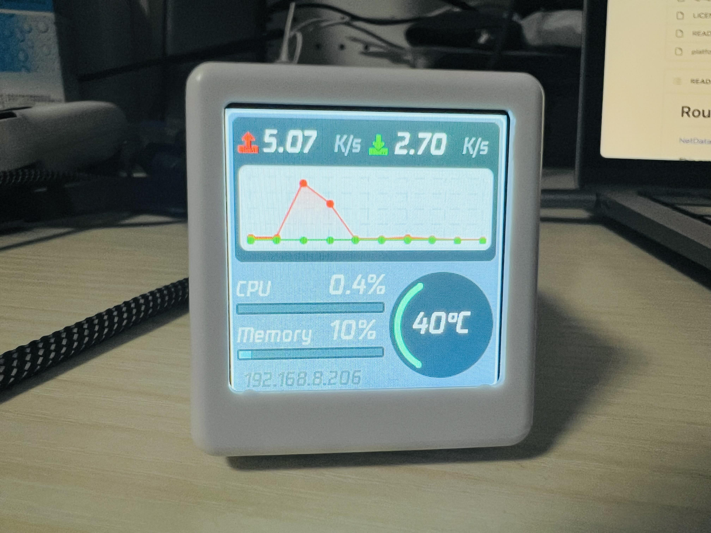

# Router Monitor

[NetData](https://github.com/netdata/netdata) Display with ESP8266 and SPI LCD

## Introduction

This mini TV project utilizes the ESP8266 module combined with a 1.54-inch SPI LCD screen to display data metrics. The data is sourced from [NetData](https://github.com/netdata/netdata) on a router, showcasing details about CPU, memory, and network usage in real-time.

**This project is originally forked from the [routermonitor](https://gitee.com/dannylsl/routermonitor) project.**

## Features

- **Compact Design**: Perfect for desktop setups.
- **Real-time Data Monitoring**: Instantly displays router metrics including CPU, memory, and network.
- **Wireless**: Leverages the WiFi capabilities of the ESP8266.

## Prerequisites

- Hardware:
  - ESP8266 Module
  - SPI LCD screen
- Software:
  - [NetData](https://github.com/netdata/netdata) installed on the router
  - PlatformIO (for ESP8266 programming)

## Setup & Installation

1. **Hardware Setup**: Connect the ESP8266 to the 1.54" SPI LCD as per the [schematics](https://oshwhub.com/Q21182889/esp-xiao-dian-shi) provided.
2. **Software Installation**: 
   - Flash the ESP8266 with the provided firmware using the VSCode IDE.
   - Ensure [NetData](https://github.com/netdata/netdata) is correctly set up and running on your router.

## Usage

1. Power on the mini TV.
2. Connect the ESP8266 to your WiFi network
3. The device should now start displaying the data metrics.

## Troubleshooting

>

## Contributing

We welcome contributions! Please read [CONTRIBUTING.md](CONTRIBUTING.md) for details on our code of conduct and the process for submitting pull requests.

## License

This project is licensed under the GPL License - see the [LICENSE.md](LICENSE.md) file for details.

## Acknowledgments

- Thanks to [NetData](https://github.com/netdata/netdata) for their comprehensive data collection tools.
- Shout out to the ESP8266 community for their resources and support.

